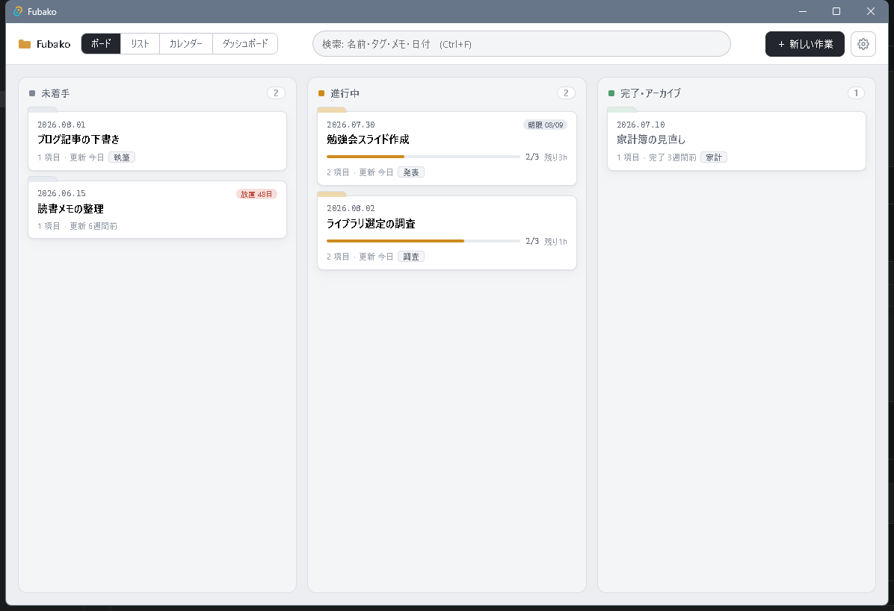

<p align="center">
  
</p>

<h1 align="center">Fubako（文箱）</h1>

<p align="center">作業フォルダを、そのままタスクに。</p>

<p align="center">
  <a href="https://github.com/Taka-S-dev/fubako/releases/latest">
    
  </a>
  <a href="https://github.com/Taka-S-dev/fubako/actions/workflows/ci.yml">
    
  </a>
</p>

<p align="center">
  <a href="https://github.com/Taka-S-dev/fubako/releases/latest"><strong>Windows 版をダウンロード</strong></a>
</p>

Fubako は、作業ディレクトリ内のフォルダをタスクとして管理する Windows 向け常駐アプリです。

「作業ごとに `20260802_調査` のような日付フォルダを作り、資料をそこに集め、終わったらアーカイブへ移す」— この運用をエクスプローラーの手作業からそのまま引き継ぎ、カンバン・検索・進捗管理を上に載せています。



## 特徴

**フォルダ = タスク。データベースは持たない。**
タスクの実体はただのフォルダで、メタデータ（状態・タグ・期限・メモ・やること）は各フォルダ直下の `.todo.json` に保存されます（サイドカー方式）。エクスプローラーで移動・リネームしてもデータは追従し、アプリを消してもデータは JSON として残ります。

作業名を変更するとフォルダ名そのものが変わります（日付は維持）。表示名を別に持たないので、アプリで見えている名前とエクスプローラーのフォルダ名が食い違うことがありません。

**完了 = 物理移動。**
タスクを完了すると、フォルダごとアーカイブディレクトリへ年別（`archive/2026/…`）に移動します。誤操作はワンクリックで復帰できます。さらに古い完了タスクは「ディープアーカイブ」（スキャン・検索対象外のコールドストレージ）へ確認付きで一括退避できます。

**ファイルシステムが主、アプリは従。**
作業ディレクトリを監視しているため、エクスプローラーで直接フォルダを作ってもアプリに即反映されます。逆に管理外のフォルダをウィンドウへドロップすれば、確認のうえ作業ディレクトリへ取り込みます。

## 機能

- **4つのビュー**: カンバンボード（ドラッグ&ドロップでステータス変更・アーカイブ移動）／ソート・フィルタ付きリスト／月カレンダー（開始・期限・完了を表示）／ダッシュボード（統計・月別完了数・放置検出・期限アラート）
- **進捗管理**: やること（サブタスク）と任意の見積時間から進捗率を自動計算（時間重み付き）。残り時間の合計も表示。手動入力モードへの切り替えも可能
- **横断検索**: フォルダ名・タグ・メモ・やること・フォルダ内のファイル名を、アーカイブ済み含めてインクリメンタル検索。`#タグ名` でタグだけに限定でき、`#調査 ライブラリ` のようにテキストと組み合わせられます
- **タグ**: チップで追加・削除。既存のタグを使用頻度順に候補表示するので、`執筆` と `ライティング` のような表記ゆれが起きにくくなっています
- **放置検出**: フォルダ内ファイルの最終更新から一定日数動きのないタスクを可視化
- **常駐**: トレイ常駐（閉じるとトレイへ）、グローバルホットキー `Ctrl+Alt+E` で即呼び出し、クイック作成（今日の日付フォルダ＋テンプレート展開）、サインイン時自動起動、多重起動防止
- **付箋モード**: 最前面に固定して細く縮めれば、作業中のタスク一覧を脇に置いたまま作業できます
- **エクスプローラー連携**: タスクからワンクリックでフォルダを開く／パスをコピー。同じフォルダのウィンドウが既にあれば、新しく開かずにそれを前面に出すので同じ窓が積み上がりません

## インストール

[最新のリリース](https://github.com/Taka-S-dev/fubako/releases/latest)から、どちらかをダウンロードしてください（[過去のリリース一覧](https://github.com/Taka-S-dev/fubako/releases)）。

| ファイル | 用途 |
|---|---|
| `Fubako.exe` | インストール不要。ダウンロードしてそのまま起動できます |
| `Fubako_x.y.z_x64-setup.exe` | インストール版。スタートメニューへの登録とアンインストーラーが付きます |

動作環境は Windows 10 20H2 以降です（この世代以降には WebView2 が標準で含まれています）。コード署名をしていないため、初回起動時に SmartScreen の警告が出ることがあります。

## 使い方

**1. 2つのフォルダを指定する**

初回起動時に「作業ディレクトリ」と「アーカイブ先」を選びます。前者は作業中のフォルダを置く場所、後者は完了したフォルダの移動先です。**既に使っているフォルダをそのまま指定できます** — 中にあるフォルダは自動的にタスクとして読み込まれ、アプリ用の初期化やファイルの追加は必要ありません。

**2. 作業を作る**

「＋ 新しい作業」（`Ctrl+N`）で名前を入れると、`20260802_調査` のように今日の日付が付いたフォルダが作られます。あとは資料をそのフォルダへ入れていくだけです。エクスプローラーで直接フォルダを作っても、監視しているので一覧に自動で現れます。

**3. 進み具合を記録する（任意）**

カードを選ぶと詳細パネルが開き、やること・見積時間・期限・タグ・メモを付けられます。やることを消化すると進捗率が自動で計算されます。何も入力しなくても、フォルダの最終更新から「放置」は検出されます。

**4. 終わったらアーカイブへ**

「完了してアーカイブ」を押すか、カードを完了カラムへドラッグすると、**フォルダごと**アーカイブ先へ年別に移動します。戻したくなったら「作業に戻す」で元の場所へ戻せます。

## 壊さない仕組み

実際のファイルを動かす道具なので、「失敗しても手元のデータが無傷であること」を設計の前提にしています。

- **移動はどの段階で失敗しても移動元が無傷。** 同一ボリュームは rename、別ボリュームは「コピー → 移動先を確定 → 最後に移動元を削除」の順で行います。コピーが途中で失敗した場合は移動元に触れずに中止します
- **開いているファイルがあるときはコピーへ退避しない。** Windows は中のファイルが開かれているとフォルダを移動できません。そこでコピーに進むと、コピーは成功しても削除に失敗して同じフォルダが2箇所に残るため、別ボリュームを示すエラーのときだけコピーを使います
- **`.todo.json` はアトミックに書き込む。** 一時ファイルへ書いてから置き換えるので、書き込み中に落ちても既存のデータは壊れません
- **パスは実体で検証する。** `canonicalize` で `..`・シンボリックリンク・ジャンクションを解決してから管理ルート配下かを判定するため、文字列上の細工が効きません
- **危険な設定を保存時に拒否。** アーカイブ先を作業ディレクトリの内側に置くなど、再帰コピーを招く組み合わせを弾きます
- **ネットワーク通信を一切行いません。** テレメトリも自動更新もなく、HTTP クライアントを依存に含みません

これらの性質は Rust のユニットテスト22件で固定しており、CI で毎回検証しています（ファイルを開いたままリネームした場合の挙動も含む）。

## キーボード操作

| キー | 動作 |
|---|---|
| `Ctrl+Alt+E` | どこからでも呼び出し（グローバル。設定で変更可） |
| `Ctrl+N` | 新しい作業を作成 |
| `Ctrl+F` または `/` | 検索へフォーカス |
| `Esc` | 絞り込み解除 → 選択解除（モーダルが開いていれば先に閉じる） |
| `↑` `↓` `Enter` | タグ候補の移動と確定 |

## 設定

| 項目 | 既定 | 説明 |
|---|---|---|
| 作業ディレクトリ | 未設定 | 監視してタスクとして並べるフォルダ |
| アーカイブ先 | 未設定 | 完了時の移動先。年別に整理されます |
| ディープアーカイブ先 | 未設定 | 古い完了タスクの退避先。スキャン・検索の対象外 |
| 整理の目安 | 6か月 | 完了からこの期間を過ぎたものを整理候補にする |
| 呼び出しホットキー | `Ctrl+Alt+E` | 空欄で無効化 |
| 放置とみなす日数 | 14日 | この期間更新の無いタスクに印を付ける |
| 新規作成テンプレート | `メモ.md` | 作成時に展開するファイル・フォルダ（末尾 `/` でフォルダ） |

## 技術構成

| レイヤ | 技術 |
|---|---|
| シェル | [Tauri 2](https://tauri.app/)（Rust） |
| フロントエンド | SvelteKit / Svelte 5 (runes) + TypeScript |
| ファイル監視 | notify クレート（デバウンス付き） |
| データ | フォルダ内 `.todo.json`（サイドカー）＋ `%APPDATA%` の設定 JSON |

常駐アプリとして軽量であることを重視し、Electron ではなく Tauri（WebView2）を採用しています。

## ソースからビルドする

```sh
npm install
npm run tauri dev    # 開発起動
npm run tauri build  # インストーラー作成 (src-tauri/target/release/bundle/)
```

要件: Node.js / Rust ツールチェーン / Windows 10+（WebView2）

## データの持ち方

```
作業ディレクトリ/
├── 20260802_障害調査/
│   ├── .todo.json      ← 状態・タグ・期限・やること等
│   └── （作業ファイル）
└── …

アーカイブ/
└── 2026/
    └── 20260601_完了済みの調査/
```

進捗率は保存せず、やることと見積から表示のたびに導出します。保存されるのは事実（何が済んだか・見積は何分か）だけです。

## ライセンス

[MIT License](LICENSE) — Copyright (c) 2026 Taka-S-dev

UI のアイコンは [Feather Icons](https://feathericons.com/)（MIT）および、その派生である [Lucide](https://lucide.dev/)（ISC）のパスに基づいています。アプリアイコンは自作です。
